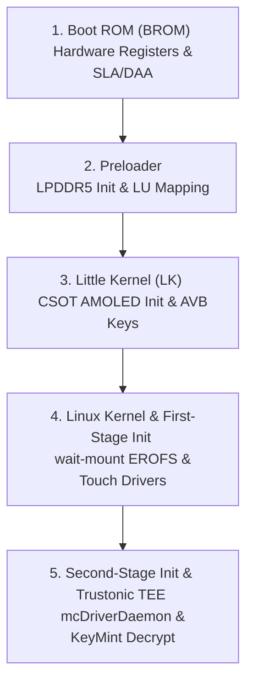

# Low-Level Boot Sequence & Security Handshake Analysis — Infinix X6871
# By Mehraan
# Custom systems engineering log mapping the 5 boot phases of the Dimensity 8200 Ultimate platform under Android 15/16.

---

## 📂 Overview

This document presents the low-level systems engineering teardown of the startup flow, hardware initialization, and security handshakes executed by the **Infinix GT 20 Pro (X6871)**. Understanding this boot sequence is essential for diagnosing bootloops, shimming vendor blobs, and porting custom systems (Android 15 XOS & Android 16 GSI).



---

## 🔑 Phase 1: Boot ROM (BROM) Stage
* **Location**: Chipset Silicon (Read-Only Hardware ROM)
* **Execution privilege**: EL3 (Highest hardware level)

### 1. Hardware Wakeup & Registers Check
When power is applied, the main CPU core 0 vectors directly to the physical Boot ROM address `0x00000000`. The BROM executes initial silicon checks, verifying supply voltages and thermal envelopes.

### 2. SLA / DAA Handshake Verification
* **SLA (Secure Local Authentication)** & **DAA (Download Agent Authentication)**: The Dimensity 8200 chipset locks down low-level programming buses. 
* **Mechanism**: If a USB connection is identified as `MediaTek USB Port (VID: 0e8d, PID: 0003)`:
  1. The Boot ROM expects an authorized, signed Download Agent (DA) keysheet containing Transsion cryptographic signatures.
  2. If the signature fails or if bypass toolsets (e.g., `MTKClient` payload engine) do not patch the Boot ROM variables, the BROM terminates communication and cycles power.

### 3. Emergency Key Combos & BROM Force
If the preloader partition is corrupt or empty, fallback to BROM is automatic. To force BROM connection on an active device:
- Press and hold **Volume Up + Volume Down** while inserting the USB cable. This registers a register short, forcing BROM to halt execution before attempting to read flash tables.

---

## 📦 Phase 2: Preloader Stage
* **Location**: UFS Boot LU A/B (Preloader partition block)
* **Execution privilege**: EL3 / EL2 secure transitions

### 1. LPDDR5 Clock Synchronization
The preloader is the first user-modifiable boot phase. Its primary responsibility is initializing system RAM:
- Reads board pinctrl offsets to configure the high-speed LPDDR5 controller clock phase lines.
- Calibrates voltage rails for the 8GB or 12GB RAM arrays to authorize secure execution windows.

### 2. UFS Logical Unit (LU) Partition Mapping
Unlike legacy EMMC storage, the X6871's UFS 3.1 flash uses isolated Logical Units:
- **LU A / B**: Contains the boot preloaders.
- **LU 0**: Holds the primary GUID Partition Table (GPT) and all OS partitions (`boot`, `vendor_boot`, `super`, `persist`, etc.).
- Preloader maps the active boot slot (using the Virtual A/B active flag) to determine whether to read partition blocks ending in `_a` or `_b`.

### 3. Security Level Checks & Signature Validation
Preloader reads the hardware public key fuses (`fpg`) to construct the **Root of Trust**:
- Verifies the cryptographic signature of the `lk` partition (Little Kernel bootloader).
- If validation succeeds, execution jumps to EL2, launching Little Kernel. If signature validation fails, the preloader triggers the hardware watchdog, leading to a permanent bootloop marked by "NV data corrupted".

---

## 💻 Phase 3: Little Kernel (LK) Stage
* **Location**: `lk_a` / `lk_b` partition blocks
* **Execution privilege**: EL2 (Hypervisor level)

### 1. Display Panel LCM Handshake
LK contains the base display drivers required for boot animations and charging indicators:
- Reads the DTBO configuration indices (`androidboot.dtbo_idx`) to determine the connected panel.
- Initialises the **Raydium RM69220** display driver IC (DDIC) via the DSI Video Mode controller.
- Powers the CSOT AMOLED panel backlight node (`mediatek,disp-leds` / `/sys/class/leds/lcd-backlight`).

### 2. Motherboard Bypass Charging Verification
LK monitors the charger insertion registers and evaluates the battery bypass profiles:
- Reads `/sys/class/power_supply/battery/bypass_charger`.
- If the bypass chargings flag is true and the chipset thermal envelope is within bounds, it configures PMIC registers to route charging current directly to the motherboard, leaving the battery cell isolated to avoid gaming heat generation.

### 3. AVB Public Key Mappings & DTB Loading
- Reads the Device Tree Blob (`prebuilt_dtb`) and Device Tree Blob Overlay (`prebuilt_dtbo.img`).
- Mapped system verification keys: Reads the AVB (Android Verified Boot) signature blocks inside the `vbmeta`, `vbmeta_system`, and `vbmeta_vendor` images to authorize logical mounts in recovery or custom ROMs.
- Passes the boot configuration command-line arguments (e.g., `bootconfig androidboot.selinux=permissive androidboot.boot_devices=11230000.msdc0`) to the kernel ramdisk tail.

---

## 🐧 Phase 4: Linux Kernel & First-Stage Init
* **Location**: `boot` (Linux Kernel) + `vendor_boot` (First-stage Ramdisk)
* **Execution privilege**: EL1 (OS Kernel level)

### 1. Kernel Modules Loading
During first-stage initialization, the kernel reads `modules.load` inside the ramdisk and loads essential hardware controllers:
- **`gt9916_common.ko`** + **`gt9886.ko`**: Spawns Goodix touchscreen digitizer buses.
- **`adaptive-ts.ko`**: Binds Transsion pocket-filtering palm rejection systems.
- **`richtap_haptic_hv.ko`**: Sets up Awinic linear vibrator motor parameters.

### 2. Wait-Mount EROFS Partitions
First-stage init parses the `fstab.mt6895` parameters to construct the virtual layout:
- Mounts `/metadata` using ext4 options to pull encryption metadata keys.
- Maps the dynamic logical super partition.
- Executes wait-mount commands to bind the stock Transsion erofs customized blocks (`tr_mi`, `tr_theme`, `tr_product`, etc.) to `/system/etc/` overlays.
- Symlinks `/dev/block/by-name/tranfs` to `/tranfs` (or routes to `/cache` inside custom recoveries to store crash buffers).

---

## 🔒 Phase 5: Second-Stage Init & Trustonic TEE Decryption
* **Location**: `/vendor/bin/` + `/system/bin/` daemons
* **Execution privilege**: EL0 (Userspace level) / EL3 secure monitors

This is the most critical phase for custom ROM and TWRP boots. If it fails, `/data` remains encrypted, blocking system framework startup.

```
[Init Process]
     │
     ▼ (FBE Encrypted /data)
[Start mobicore Daemon] ──> Load Persist SFS Registry (/mnt/vendor/persist/mcRegistry)
     │
     ▼ (TEE Handshake Active)
[Start vendor.keymint-trustonic] ──> Connect to EL3 Mobicores via mcDriverDaemon
     │
     ▼ (KeyMint Ready)
[Start vendor.gatekeeper-1-0] ──> Load Pin/Pattern Salt Offsets
     │
     ▼ (Vold Mount Handshake)
[Vold Decrypts /data] ──> Authorizes File-Based Encryption (FBE) Mounting
```

### 1. mcDriverDaemon Initialization
Init runs `/vendor/bin/mcDriverDaemon` with Mobicores persistent registry arguments:
- Daemon reads persist calibration flags at `/mnt/vendor/persist/mcRegistry/`.
- Loads secure drbin drivers (`05070000000000000000000000000000.drbin` for Goodix FP, `40188311faf343488db888ad39496f9a.drbin` for Widevine) directly into the secure enclave space.

### 2. KeyMint & Gatekeeper Binderization
With the TEE channel open, userspace daemons execute:
1. **`vendor.keymint-trustonic`**: Launches and registers Keymaster/KeyMint AIDL binder service endpoints.
2. **`vendor.gatekeeper-1-0`**: Launches to process screen lock salts.
3. If daemons fail to register within the AIDL binder timeout (10 seconds), first-stage init flags the watchdog, forcing a reboot to recovery.

### 3. Vold File-Based Encryption (FBE) Decrypt
- Vold reads the metadata descriptors at `/metadata/vold/metadata_encryption`.
- Authenticates the decryption handshake via the KeyMint AIDL service.
- Mounts `/data` as a fully readable `f2fs` volume, launching the second-stage Android runtime framework (`zygote`, `system_server`, `SurfaceFlinger`, and UI launcher).

---

## 🔍 Engineering Verification Checklist

To debug boot loop states at each phase, perform these command checkups:

| Phase | Diagnostic Action | Expected Signature |
|-------|-------------------|--------------------|
| **BROM** | Monitor Device Manager / syslog | `MediaTek USB Port (VID: 0e8d, PID: 0003)` |
| **Preloader**| Check BROM console UART logs | `[MEM] LPDDR5 init successful` |
| **LK** | Check fastboot USB identifiers | `fastboot getvar product` -> `X6871` |
| **Kernel** | View console ramoops post-crash | `/sys/fs/pstore/console-ramoops` |
| **TEE / FBE**| Audit active binder processes | `dumpsys android.hardware.security.keymint.IKeyMintDevice/default` |
